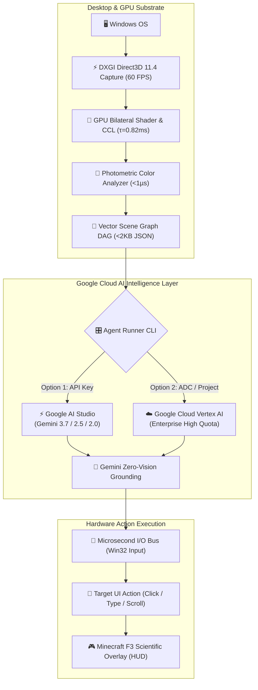

# 🌐 Google Cloud AI & Gemini Master Setup Guide for VACT

> [!IMPORTANT]
> **100% Google Cloud AI Native Engine**:
> VACT is built exclusively on **Google Cloud Vertex AI** and **Google AI Studio** with the **Google Gemini** model family (Gemini 3.7, 2.5, 2.0, 1.5). It bypasses traditional multi-megabyte screenshot streaming by sending ultra-compact **<2KB Vector ASTs** directly to Google Gemini at 60 FPS.

---

## 🧭 Architecture & Cloud Pipeline



---

## ⚡ Option 1: Google AI Studio (Easiest & Fastest — Zero Installs)

> [!TIP]
> **Best for Instant Testing & Hackathon Evaluation:** No SDKs or command-line tools to install. You only need a free API key!

### Step 1: Obtain a Free Google AI Studio API Key
1. Visit [aistudio.google.com](https://aistudio.google.com/).
2. Click **"Get API key"** $\rightarrow$ **"Create API key"** (in a new or existing project).
3. Copy your secret key (begins with `AIzaSy...`).

### Step 2: Automatic CLI Configuration Wizard
You don't even need to edit `.env` manually! When you run `npm run dev`, if no API key is detected, the CLI will automatically prompt you for your key and write it directly to `.env` for you.

Or if you prefer manual configuration, edit `apps/agent-runner/.env`:
```env
# Google AI Studio API Key
GEMINI_API_KEY=AIzaSyYourSecretKeyHere

# Default Configuration
GOOGLE_BACKEND=ai-studio
GEMINI_MODEL=gemini-2.5-flash
```

> [!NOTE]
> You can also set it temporarily in PowerShell without saving to a file:
> ```powershell
> $env:GEMINI_API_KEY="AIzaSyYourSecretKeyHere"
> ```

### Step 3: Run the Agent
```bash
cd apps/agent-runner
npm run dev
```
Select **`[1] ⚡ Google AI Studio`**, pick your model (e.g. `[1] gemini-3.7-flash` or `[4] gemini-2.5-flash`), and you're live!

---

## ☁️ Option 2: Google Cloud Vertex AI & `gcloud` CLI (Enterprise)

> [!TIP]
> **Best for Production & High Rate Limits:** Connects directly to Google Cloud Vertex AI with 1,000+ RPM and 4M TPM quotas.

### Step 1: Install Google Cloud SDK on Windows

#### Method A: Using Windows Package Manager (`winget`)
Open PowerShell as Administrator and run:
```powershell
winget install Google.CloudSDK
```
*(Accept the administrator UAC prompt when it appears).*

#### Method B: Official Installer
Download and run the [Google Cloud SDK Windows Installer](https://dl.google.com/dl/cloudsdk/channels/rapid/GoogleCloudSDKInstaller.exe).

---

### Step 2: Initialize `gcloud` & Select Your Cloud Project

Open a new PowerShell terminal and run:
```powershell
gcloud init
```

The interactive setup will guide you through authentication and project selection:

```text
Welcome! This command will take you through the configuration of gcloud.

You must sign in to continue. Would you like to sign in (Y/n)? Y
[Your browser will open to log in with your Google account]

You are signed in as: [your-account@gmail.com]

Pick cloud project to use:
 [1] my-ai-project-1001
 [2] my-vertex-ai-project
 [3] your-gcp-project-id
 [4] Enter a project ID
 [5] Create a new project
Please enter numeric choice: 3

Your current project has been set to: [your-gcp-project-id].
The Google Cloud CLI is configured and ready to use!
```

---

### Step 3: Authenticate Application Default Credentials (ADC)

> [!IMPORTANT]
> **Required for Vertex AI Node.js / Python SDKs:**
> Run this command to authorize local SDKs to call Vertex AI directly:
> ```powershell
> gcloud auth application-default login
> ```
> This opens your browser one last time to grant local developer credentials.

---

### Step 4: Configure `apps/agent-runner/.env`

In `apps/agent-runner/.env`:
```env
# Google Cloud Vertex AI Project Settings
GOOGLE_CLOUD_PROJECT=your-gcp-project-id
GOOGLE_CLOUD_LOCATION=us-central1
GOOGLE_BACKEND=vertex
GEMINI_MODEL=gemini-2.5-flash
```

---

### Step 5: Launch VACT with Vertex AI

```bash
cd apps/agent-runner
npm run dev
```
Select **`[2] ☁️ Google Cloud Vertex AI`** $\rightarrow$ choose your model $\rightarrow$ begin autonomous OS execution!

---

## 🎮 Interactive CLI Features

```text
================================================================================
  🏆 VACT: AUTONOMOUS DESKTOP AGENT (100% GOOGLE CLOUD GEMINI & VERTEX AI)
  Real-Time 60 FPS Vector Scene Graph & Hardware I/O Engine
================================================================================

⚡ STEP 1: SELECT GOOGLE CLOUD AI BACKEND
  [1] ⚡ Google AI Studio (API Key Authentication - Fastest setup)
  [2] ☁️  Google Cloud Vertex AI (Enterprise ADC / Cloud Project)

Select Backend [1-2] (default: 1): 1

⚡ STEP 2: SELECT GOOGLE GEMINI MODEL & QUOTA PROFILE
  [1]   Gemini 3.7 Flash               [🟢 NEXT-GEN FLASH]     1,000+ RPM / Ultra Low Latency
  [2]   Gemini 3.7 Pro                 [🟡 NEXT-GEN PRO]       High Cognitive Depth / Coding & Systems
  [3]   Gemini 3.7 Flash Thinking      [🟡 NEXT-GEN THINKING]  Dynamic Chain-of-Thought Engine
  [4]   Gemini 2.5 Flash               [🟢 RECOMMENDED]        1,000+ RPM on Vertex / Instant [RECOMMENDED]
  [5]   Gemini 2.5 Pro                 [🔴 HEAVY REASONING]    2-5 RPM Free Tier / Deep Logic
  [6]   Gemini 2.0 Flash               [🟢 ULTRA-FAST]         1,000+ RPM / Low Latency
  [7]   Gemini 2.0 Flash-Lite          [🟢 ULTRA-LIGHT]        Highest Throughput / Minimal Latency
  [8]   Gemini 2.0 Flash Thinking      [🟡 CHAIN OF THOUGHT]   30 RPM / Step-by-Step Reasoning
  [9]   Gemini 2.0 Pro Exp             [🟡 PRO EXPERIMENTAL]   Experimental Coding & System Logic
  [10]  Gemini 1.5 Flash               [🟢 HIGH SPEED]         1,000+ RPM / High Throughput
  [11]  Gemini 1.5 Pro                 [🟡 2M CONTEXT]         2-5 RPM Free Tier / Massive Context
  [C]   ✍️  Enter Custom / Preview Model (e.g. gemini-3.7-flash, custom-endpoint)
  [S]   🌐 Live Scan: Query Google API for all newly active Gemini models
```

- **Live Model Scanner (`[S]`)**: Dynamically queries Google's Generative Language API in real-time to discover all newly activated models.
- **Custom Identifier (`[C]`)**: Type any custom, preview, or experimental model name.
- **2-Word Status Ticker**: Visual real-time state machine feedback (`[SCANNING SCENE]`, `[GEMINI REASONING]`, `[DISPATCHING CLICK]`, `[SYNCING 60FPS]`, `[MISSION COMPLETE]`).

---

## 🎨 GPU Photometric Color Grounding

> [!NOTE]
> VACT extracts dominant RGB, hex palettes (`#FF3B30`), and semantic colors (`red`, `blue`, `green`, `orange`, `yellow`, `dark_gray`) directly from the raw GPU frame buffer in $< 1\,\mu\text{s}$ per element.

When you pass instructions mentioning visual colors:
- *"Click the red record button"*
- *"Select the blue timeline track"*
- *"Click the orange grade node"*

Google Gemini directly inspects the node attributes:
```text
• [ID: #14] BUTTON "Record" [color: red (#FF3B30)] [CLICKABLE] bounds=[x:520, y:800, w:110, h:36]
• [ID: #28] CONTAINER "Audio Track 1" [color: blue (#007AFF)] bounds=[x:240, y:600, w:1200, h:80]
```
This guarantees **zero hallucination** and instantaneous execution speed.

---

## 🕹️ Minecraft F3 Scientific HUD & Hitbox Overlay

Launch the native daemon with the `--overlay` flag:

```bash
cargo run -p vactd -- start --overlay
```

```
┌── Minecraft F3 Telemetry (Left) ──────────┐  ┌── Google Cloud Intelligence (Right) ─────┐
│ VACT 1.0.0 (Direct3D 11.4 / 60.0 fps)     │  │ Google Cloud Vertex AI & Gemini Bus      │
│ E: 18 hitboxes / 42 nodes                 │  │ Vector DAG: Δ=1.15 KB/frame              │
│ GPU Pipeline: τ_GPU=0.82ms                │  │ Target: Focused Control ID #14           │
│ Hardware OCR: WinRT Active                │  │ Safety Bus: 🟢 ARMED (F12 Kill-Switch)   │
└───────────────────────────────────────────┘  └──────────────────────────────────────────┘
```

- **🟩 Minecraft F3+G Spatial Chunks**: Screen partitioned into $160\text{px} \times 160\text{px}$ grid chunks.
- **📦 Clean Component Hitboxes**:
  - 🟢 **Buttons**: Clean cyan hitboxes, center target crosshair $\odot$, and `[#ID BTN: "Label" • COLOR]` badges.
  - 🟢 **Inputs**: Spring green hitboxes with vertical cursor carets `|`.
  - 🟣 **Text**: Subtle baseline underlines `─────` preserving reading clarity.
- **🎯 Dynamic AI Shockwaves**: Expanding animated reticle ripples at the exact click coordinate whenever Gemini dispatches an action.

---

## 🛡️ Safety & Emergency Controls

> [!CAUTION]
> Safety is enforced directly at the hardware I/O bus layer.

- **Emergency Stop**: Press <kbd>F12</kbd> anywhere on Windows to instantly freeze all synthetic mouse and keyboard dispatch.
- **Re-Arm I/O Bus**: Press <kbd>Ctrl</kbd> + <kbd>F12</kbd> to resume automation.
- **Zero Capture Recursion**: The overlay window uses `WDA_EXCLUDEFROMCAPTURE` to eliminate DXGI capture feedback loops.

---

## ⚡ Rate Limit & Quota Mitigation

> [!WARNING]
> **Free-Tier Protection:** If you are testing with Google AI Studio free tier:

1. **Automatic Step Pacing (1.2s Cadence)**: Prevents microsecond GPU loops from triggering burst rate limits.
2. **Dynamic Header Parsing**: Parses `retryDelay` from Google's response headers and waits automatically with randomized jitter.
3. **Automatic Fallback Sequence**: Seamlessly steps down through `gemini-2.5-flash` $\rightarrow$ `gemini-2.0-flash` $\rightarrow$ `gemini-1.5-flash` if an endpoint is congested.

---

## 👥 Authors & License

- **fy2ne ([@fy2ne](https://github.com/fy2ne))** — Core Architecture, DirectX GPU Compute & Rust Daemon (`<hello@fy2ne.me>`)

Licensed under the **Apache License 2.0**.
