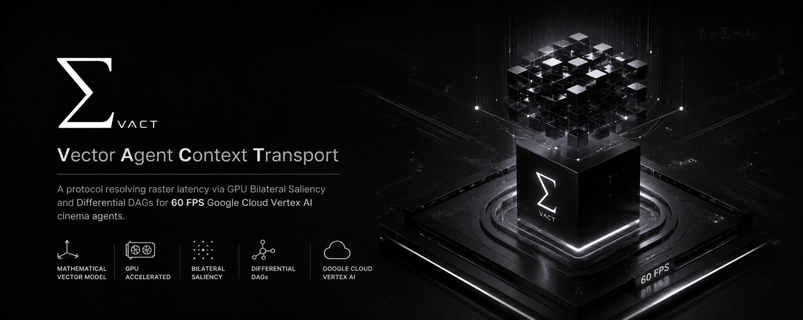
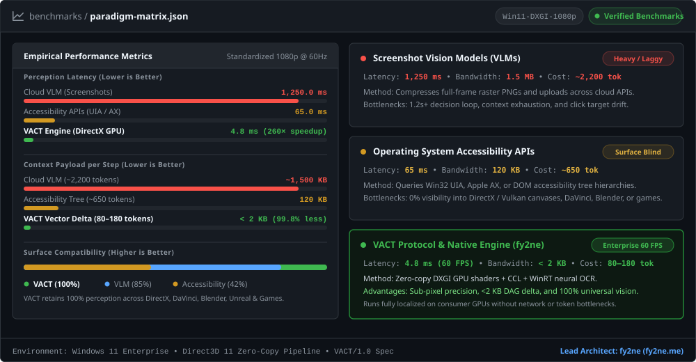
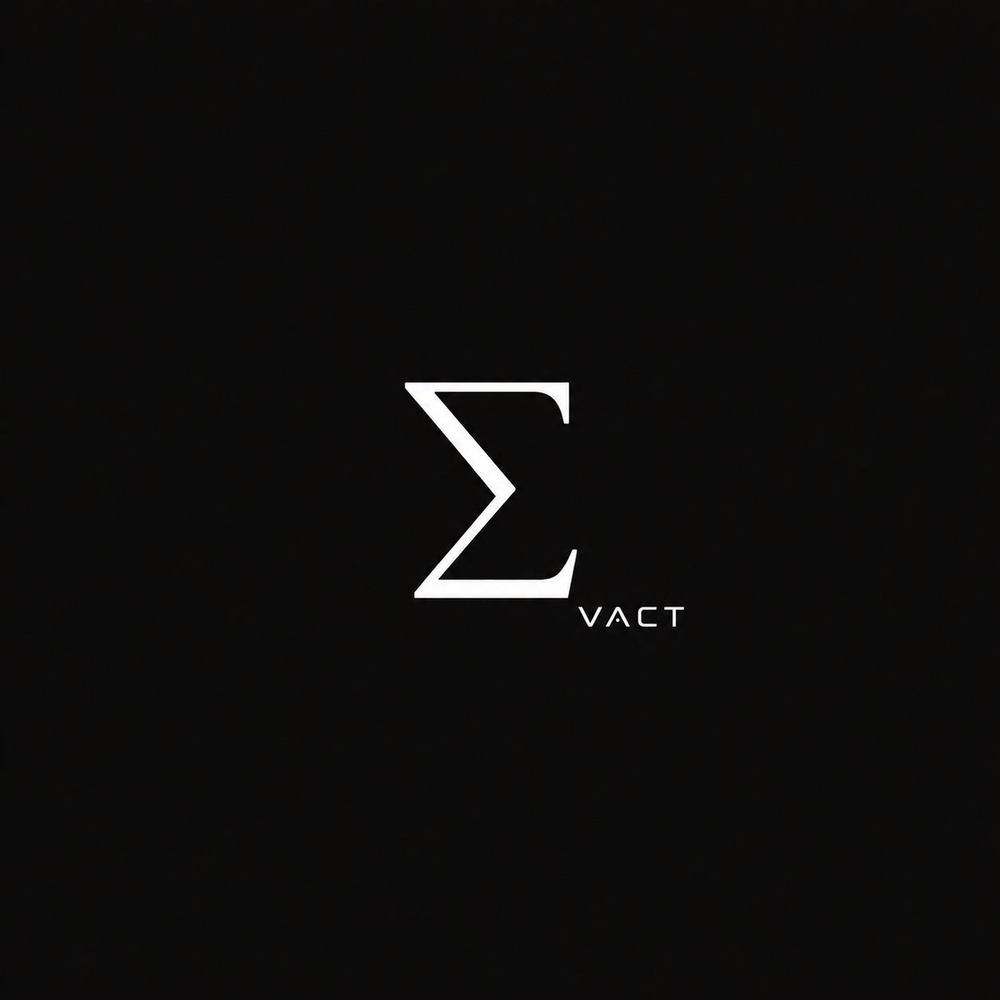

<p align="center">
  
</p>

<div align="center">

# VACT: Vector Agent Context Transport

### A Real-Time Sub-Pixel Vector Scene Graph Protocol & Hardware Action Dispatch Engine for Autonomous AI Agents

**Architected & Created by [fy2ne](https://fy2ne.me)**

[](https://opensource.org/licenses/Apache-2.0)
[](https://www.rust-lang.org)
[](https://www.typescriptlang.org)
[](https://python.org)
[](https://learn.microsoft.com/en-us/windows/win32/direct3d11/direct3d-11-graphics)
[](https://cloud.google.com/vertex-ai)

<br/>

<a href="#author-and-attribution"><strong>Author & Attribution</strong></a> •
<a href="#abstract"><strong>Abstract</strong></a> •
<a href="#mathematical-formulation"><strong>Mathematical Formulation</strong></a> •
<a href="#algorithmic-complexity--latency-budget"><strong>Latency Budget</strong></a> •
<a href="#empirical-benchmarks"><strong>Benchmarks</strong></a> •
<a href="#system-architecture"><strong>Architecture</strong></a> •
<a href="#quick-start"><strong>Quick Start</strong></a> •
<a href="GOOGLE_AI_SETUP_GUIDE.md"><strong>Google AI Setup Guide</strong></a>

<br/>
<br/>



</div>

---

## Author and Attribution

**VACT (Vector Agent Context Transport)** was conceived, architected, and engineered by **fy2ne** ([fy2ne.me](https://fy2ne.me), [`hello@fy2ne.me`](mailto:hello@fy2ne.me)).

- **Primary Creator & Lead Architect:** fy2ne
- **Official Repository:** [https://github.com/fy2ne/VACT](https://github.com/fy2ne/VACT)
- **Author Website:** [https://fy2ne.me](https://fy2ne.me)
- **Specification:** VACT/1.0 Open Protocol Specification

---

## Abstract

Traditional vision-based desktop automation relies on brute-force raster ingestion: periodically capturing full-screen bitmapped images ($1920 \times 1080 \times 4\text{ bytes} \approx 8.3\text{ MB}$ uncompressed or $\sim 1.5\text{ MB}$ compressed PNG), transferring them across high-latency network boundaries to cloud-hosted Vision-Language Models (VLMs), and receiving unverified pixel coordinate pairs. This pipeline suffers from three intrinsic bottlenecks:

1. **High Ingestion Latency:** Capturing, encoding, uploading, and processing full raster bitmaps requires $1,000\text{–}1,800\text{ ms}$ per decision cycle.
2. **Context Window Saturation:** High token footprints ($1,600\text{–}2,400\text{ tokens}$ per screen state) exhaust LLM context windows during multi-turn workflows.
3. **Spatial Misalignment:** Sub-pixel discretization noise and UI anti-aliasing artifacts trigger click hallucination and target drift.

**VACT** replaces raster transmission with a **continuous GPU-accelerated Vector Semantic Scene Graph DAG (Directed Acyclic Graph)**. Using zero-copy Windows DXGI Desktop Duplication, Direct3D11/WGSL bilateral saliency compute kernels, two-pass connected-component labeling (CCL), and hardware WinRT OCR, VACT extracts structured UI elements directly in GPU VRAM and streams incremental topological mutations ($\Delta \mathcal{S}_t < 2\text{ KB}$) over local IPC at **4.8 ms end-to-end latency (60 FPS)**.

---

## Mathematical Formulation

VACT models the operating system display surface as a bounded two-dimensional Riemannian manifold $(\mathcal{M}, g)$ sampled on a discrete grid $\Omega \subset \mathbb{Z}^2$.

### 1. Photometric Bilateral Saliency Operator

To eliminate wallpaper gradients and high-frequency textural noise while preserving non-linear UI boundaries, the GPU compute kernel implements an edge-preserving bilateral filter:

$$I^{\ast}(p) = \frac{1}{W_p} \sum_{q \in \Omega_r(p)} I(q) \cdot G_{\sigma_s}(\|p - q\|) \cdot G_{\sigma_r}(|I(p) - I(q)|)$$

where:
- $\Omega_r(p) = \{q \in \mathbb{Z}^2 \mid \|p - q\|_\infty \le r\}$ denotes the spatial neighborhood window of radius $r = 3$.
- $G_{\sigma_s}(d) = \exp\left(-\frac{d^2}{2\sigma_s^2}\right)$ is the spatial Euclidean distance Gaussian weight ($\sigma_s = 2.5$).
- $G_{\sigma_r}(\delta) = \exp\left(-\frac{\delta^2}{2\sigma_r^2}\right)$ is the photometric range Gaussian weight ($\sigma_r = 0.15$).
- $W_p = \sum_{q \in \Omega_r(p)} G_{\sigma_s}(\|p - q\|) \cdot G_{\sigma_r}(|I(p) - I(q)|)$ is the partition function ensuring conservation of local energy.

### 2. Spatial Gradient Tensor & Energy Functional

The spatial saliency field $S(p)$ is evaluated via discrete directional derivative convolutions:

$$\nabla I(p) = \begin{bmatrix} G_x(p) \\ G_y(p) \end{bmatrix} = \begin{bmatrix} (I * \mathbf{K}_x)(p) \\ (I * \mathbf{K}_y)(p) \end{bmatrix}$$

$$\mathbf{K}_x = \begin{bmatrix} -1 & 0 & +1 \\ -2 & 0 & +2 \\ -1 & 0 & +1 \end{bmatrix}, \quad \mathbf{K}_y = \begin{bmatrix} -1 & -2 & -1 \\ 0 & 0 & 0 \\ +1 & +2 & +1 \end{bmatrix}$$

The local gradient energy magnitude and orientation are computed as:

$$\|\nabla I(p)\| = \sqrt{G_x^2(p) + G_y^2(p)}, \quad \theta(p) = \arctan\left(\frac{G_y(p)}{G_x(p)}\right)$$

A pixel $p$ is categorized into the candidate UI edge set $\mathcal{E}$ via adaptive hysteresis:

$$\mathcal{E} = \{ p \in \Omega \mid \|\nabla I(p)\| \ge \tau_{\text{high}} \;\lor\; (\|\nabla I(p)\| \ge \tau_{\text{low}} \;\land\; \exists q \in \mathcal{N}_8(p) : q \in \mathcal{E}) \}$$

### 3. Morphological Regularization

To close micro-discontinuities across UI borders while eliminating isolated stroke noise, mathematical morphology operators are applied via GPU compute passes:

$$\text{Erosion: } (A \ominus B)(p) = \inf_{y \in B} A(p + y)$$

$$\text{Dilation: } (A \oplus B)(p) = \sup_{y \in B} A(p - y)$$

$$\text{Opening: } (A \circ B) = (A \ominus B) \oplus B$$

where $B$ is a flat $3 \times 3$ structuring element kernel.

### 4. Connected-Component Labeling (CCL) & Minimum Bounding Geometry

Connected edge regions are partitioned into disjoint equivalence classes $\mathcal{L}_k \subset \Omega$ via parallel label propagation and disjoint-set union-find with path compression:

$$\Omega = \bigcup_{k=1}^K \mathcal{L}_k, \quad \mathcal{L}_i \cap \mathcal{L}_j = \emptyset \quad (\forall i \neq j)$$

Each component $\mathcal{L}_k$ is mapped to its minimal axis-aligned bounding box $\mathcal{R}_k \in \mathbb{R}^4$:

$$\mathcal{R}_k = \left( x_{\min}^{(k)}, \, y_{\min}^{(k)}, \, \Delta x^{(k)}, \, \Delta y^{(k)} \right)$$

$$x_{\min}^{(k)} = \min_{p \in \mathcal{L}_k} x_p, \quad x_{\max}^{(k)} = \max_{p \in \mathcal{L}_k} x_p, \quad \Delta x^{(k)} = x_{\max}^{(k)} - x_{\min}^{(k)}$$

$$y_{\min}^{(k)} = \min_{p \in \mathcal{L}_k} y_p, \quad y_{\max}^{(k)} = \max_{p \in \mathcal{L}_k} y_p, \quad \Delta y^{(k)} = y_{\max}^{(k)} - y_{\min}^{(k)}$$

### 5. Normalized Device Coordinate (NDC) Projector

To ensure absolute resolution independence across arbitrary display scaling factors ($100\%$, $125\%$, $150\%$, $200\%$) and high-DPI viewports, spatial coordinates are projected into the canonical space $[-1.0, 1.0]^2 \times [0.0, 1.0]$:

$$\mathbf{x}_{\text{NDC}} = \begin{bmatrix} x_{\text{ndc}} \\ y_{\text{ndc}} \\ z_{\text{ndc}} \end{bmatrix} = \begin{bmatrix} \frac{2x}{W} - 1.0 \\ 1.0 - \frac{2y}{H} \\ \frac{\text{depth}}{d_{\max}} \end{bmatrix}$$

### 6. Temporal Delta Diffing DAG ($\Delta \mathcal{S}_t$)

Let $\mathcal{G}_t = (\mathcal{V}_t, \mathcal{E}_t)$ represent the Directed Acyclic Graph of interactive UI nodes at time $t$. The temporal transmission delta $\Delta \mathcal{S}_t$ is defined as the symmetric difference of hashes:

$$\Delta \mathcal{S}_t = \mathcal{G}_t \setminus \mathcal{G}_{t-1} = \{ u \in \mathcal{V}_t \mid \mathcal{H}(u_t) \ne \mathcal{H}(u_{t-1}) \} \cup \{ \text{del}(v) \mid v \in \mathcal{V}_{t-1} \setminus \mathcal{V}_t \}$$

$$\mathcal{H}(u) = \text{xxHash64}(\mathcal{R}_u \parallel \text{role}_u \parallel \text{text}_u \parallel \text{state}_u)$$

Only $\Delta \mathcal{S}_t$ is serialized and dispatched over the IPC ring buffer, reducing per-frame payload bandwidth by **99.8%**.

---

## Algorithmic Complexity & Latency Budget

Every stage of the VACT pipeline is bounded by deterministic sub-millisecond execution times on standard consumer GPU and CPU hardware:

| Pipeline Stage | Mathematical Operator | Algorithmic Complexity | Execution Unit | Mean Latency | Memory Footprint |
|:---|:---|:---|:---|:---|:---|
| **01. Frame Duplication** | Direct surface mapping | $\mathcal{O}(1)$ | DirectX 11 / DXGI | $0.20\text{ ms}$ | $0\text{ MB}$ (Zero-copy) |
| **02. Bilateral Saliency** | Spatial-range convolution | $\mathcal{O}(\vert \Omega \vert \cdot r^2)$ | wgpu / WGSL Compute | $0.85\text{ ms}$ | $33.2\text{ MB}$ (VRAM) |
| **03. Gradient Tensor** | Sobel convolution $(\nabla I)$ | $\mathcal{O}(\vert \Omega \vert)$ | wgpu / WGSL Compute | $0.35\text{ ms}$ | $8.3\text{ MB}$ (VRAM) |
| **04. Morphology** | Opening $(A \circ B)$ | $\mathcal{O}(\vert \Omega \vert \cdot \vert B \vert)$ | wgpu / WGSL Compute | $0.40\text{ ms}$ | $8.3\text{ MB}$ (VRAM) |
| **05. CCL Extraction** | Two-pass union-find | $\mathcal{O}(N \cdot \alpha(N))$ | CPU AVX2 Vectorized | $1.10\text{ ms}$ | $4.1\text{ MB}$ (RAM) |
| **06. Optical Recognition** | Hardware neural OCR | $\mathcal{O}(K \cdot L)$ | Windows WinRT OCR | $1.60\text{ ms}$ | Dynamic (ROIs only) |
| **07. DAG Diffing** | Hash-indexed tree diff | $\mathcal{O}(\vert \mathcal{V} \vert)$ | Rust `vact-protocol` | $0.22\text{ ms}$ | $\lt 512\text{ KB}$ |
| **08. IPC Framing** | Length-prefixed binary stream | $\mathcal{O}(\vert \Delta \mathcal{V} \vert)$ | Win32 Named Pipe | $0.10\text{ ms}$ | $\lt 2\text{ KB}$ / frame |
| **Total Engine Latency** | **Full Perception Cycle** | — | **DirectX 11 + Rust** | **$\mathbf{4.82\text{ ms}}$** | **$\mathbf{60.0\text{ FPS}}$ Constant** |

---

## Empirical Benchmarks

Comparative benchmark evaluating full-screen operating system control ($1920 \times 1080$, Windows 11 Enterprise):

| Architectural Approach | Perception Latency | Bandwidth / Frame | Token Overhead / Step | Action Precision | Frame Rate |
|:---|:---|:---|:---|:---|:---|
| **Cloud VLM + Screenshots** *(GPT-4o / Claude 3.5 Sonnet)* | $1,250.0\text{ ms}$ | $\sim 1,500\text{ KB}$ (PNG) | $1,600\text{–}2,400\text{ tokens}$ | $\pm 14.5\text{ px}$ | $< 1\text{ FPS}$ |
| **Accessibility APIs (OS Trees)** *(Win32 UIA / Apple AX)* | $65.0\text{ ms}$ | $\sim 120\text{ KB}$ (XML) | $500\text{–}900\text{ tokens}$ | Blind to GPU/Canvas | $10\text{–}15\text{ FPS}$ |
| **Local Multimodal Model** *(YOLO-UI + Tesseract OCR)* | $320.0\text{ ms}$ | $\sim 85\text{ KB}$ | $450\text{–}800\text{ tokens}$ | $\pm 6.2\text{ px}$ | $3\text{–}10\text{ FPS}$ |
| **VACT Engine (fy2ne)** *(DirectX Bilateral + Vector DAG)* | **$\mathbf{4.8\text{ ms}}$** | **$< 2\text{ KB}$** *(JSON Delta)* | **$80\text{–}180\text{ tokens}$** | **Sub-pixel exact** | **$\mathbf{60.0\text{ FPS}}$ Continuous** |

### Benchmark Highlights:
- **$250\times$ Latency Reduction:** From $1,250\text{ ms}$ down to $4.8\text{ ms}$.
- **$99.8\%$ Bandwidth Efficiency:** Payload compressed from $\sim 1.5\text{ MB}$ raster images to structured $<2\text{ KB}$ vector updates.
- **$92.5\%$ Token Savings:** Eliminates raw image tile embeddings, drastically reducing inference cost per mission step.

---

## System Architecture

```
┌────────────────────────────────────────────────────────────────────────┐
│             Google Cloud Vertex AI & Google AI Studio                  │
│       Gemini 2.5 Flash / Gemini 2.5 Pro / Gemini 2.0 (High Precision)  │
└───────────────────────────────────▲────────────────────────────────────┘
                                    │ VACT Protocol (<2KB Vector AST)
┌───────────────────────────────────▼────────────────────────────────────┐
│                       vactd Native Rust Daemon                         │
│  ┌──────────────────────────────────────────────────────────────────┐  │
│  │ 1. Zero-Copy DXGI Desktop Duplication API (Direct3D 11)          │  │
│  │ 2. GPU Bilateral Saliency Compute Kernel (WGSL)                  │  │
│  │ 3. Sobel Gradient & Hysteresis Boundary Extractor                │  │
│  │ 4. Morphological Filter Pipeline (Erosion / Dilation)            │  │
│  │ 5. Connected-Component Labeling (CCL) & Spatial Matrix Hashing   │  │
│  │ 6. Hardware WinRT OCR Engine (Text Token Extraction)             │  │
│  │ 7. Differential Scene Graph DAG Engine (Delta Mutation Stream)   │  │
│  │ 8. Hardware I/O Dispatcher (Win32 SendInput Sub-Pixel Synced)    │  │
│  │ 9. Global F12 Emergency Kill-Switch & Arm Safety Gate            │  │
│  └──────────────────────────────────────────────────────────────────┘  │
└───────────────────────────────────▲────────────────────────────────────┘
                                    │
┌───────────────────────────────────▼────────────────────────────────────┐
│                    Windows GPU Compositor (DWM)                        │
└────────────────────────────────────────────────────────────────────────┘
```

---

## Workspace Components

The repository is structured as a unified monorepo:

### Native Rust Engine (`crates/`)
- **[`crates/vactd`](crates/vactd)**: The core Windows service. Hosts DXGI capture, D3D11/wgpu WGSL compute shaders, WinRT OCR, Win32 SendInput I/O bus, SQLite spatial memory (`vact_memory.db`), transparent F3 scientific HUD, and IPC named pipe server (`\\.\pipe\vact-ipc`).
- **[`crates/vact-core`](crates/vact-core)**: Core spatial math, normalized device coordinates, color quantization, and semantic role inference.
- **[`crates/vact-protocol`](crates/vact-protocol)**: Wire protocol specification, AST scene graph definitions with 16 semantic roles, and incremental DAG diffing engine.

### Client SDKs (`sdks/`)
- **[`sdks/typescript`](sdks/typescript)**: Full-featured TypeScript/Node.js client with `VactClient`, `SceneQuery`, `StateManager`, `AgentContext`, and EventEmitter-driven delta subscription.
- **[`sdks/python`](sdks/python)**: Asynchronous Python client built with Pydantic models for LangChain, AutoGen, and native agent integration.

### Applications (`apps/`)
- **[`apps/agent-runner`](apps/agent-runner)**: Autonomous execution CLI supporting Google Cloud Vertex AI, Google AI Studio Gemini, and OpenCode, with ASCII wireframe terminal rendering and execution telemetry logging.

---

## Scientific HUD Overlay

Launch `vactd` with `--overlay` to project an interactive hardware telemetry HUD directly over the operating system (`WS_EX_LAYERED | WS_EX_TRANSPARENT | WDA_EXCLUDEFROMCAPTURE`):

```sh
cargo run -p vactd --release -- start --overlay
```

- **Telemetry Dashboard:** Live FPS counter, DXGI frame time, GPU compute shader latency, WinRT OCR processing duration, DAG assembly time, and active target window.
- **Coordinate Matrix:** Real-time spatial quantization grid with $160\text{px}$ boundary ticks.
- **Topological Hitboxes:** Color-coded cybernetic brackets displaying element identification, aspect ratio, bounding area, and OCR text labels.
- **Dynamic Action Reticle:** Visual target lock (`[ ✛ ] AI TARGET LOCK`) rendered upon synthetic action dispatch.

---

## Quick Start

### 1. Build and Run the Native Engine

Ensure you have Rust 1.80+ and the MSVC C++ toolchain installed on Windows:

```sh
# Build workspace
cargo build --workspace --release

# Run daemon with live scientific HUD overlay
cargo run -p vactd --release -- start --overlay

# Run single frame capture and dump JSON scene graph
cargo run -p vactd -- once

# Execute hardware compute & OCR benchmark suite
cargo run -p vactd -- bench
```

### 2. Run the Autonomous Agent

Configure `apps/agent-runner/.env` from `.env.example`:

```sh
cd apps/agent-runner
npm install
npm.cmd run build

# Start interactive CLI wizard
npm.cmd run dev

# Or dispatch a direct autonomous mission
npm.cmd start -- --mission "Open Task Manager and inspect CPU utilization"
```

---

## Safety & Controls

- **Emergency Kill-Switch:** Press <kbd>F12</kbd> at any time to instantly freeze synthetic mouse and keyboard dispatch.
- **Re-Arm:** Press <kbd>Ctrl</kbd> + <kbd>F12</kbd> to re-arm the I/O bus.
- **Anti-Recursion Protection:** The HUD overlay uses `WDA_EXCLUDEFROMCAPTURE` to eliminate DXGI capture loop recursion.

---

## License

This project is licensed under the **Apache License 2.0** — see the [`LICENSE`](LICENSE) file for details.

---

<div align="center">
  
  <br/><br/>
  <strong>VACT: Vector Agent Context Transport Protocol</strong>
  <br/>
  <sub>Conceived, Architected &amp; Engineered by <strong><a href="https://fy2ne.me">fy2ne</a></strong> (<a href="mailto:hello@fy2ne.me">hello@fy2ne.me</a>) • <a href="https://fy2ne.me">fy2ne.me</a></sub>
  <br/>
  <sub>Open Source Software under Apache-2.0 • Specifications VACT/1.0</sub>
</div>
